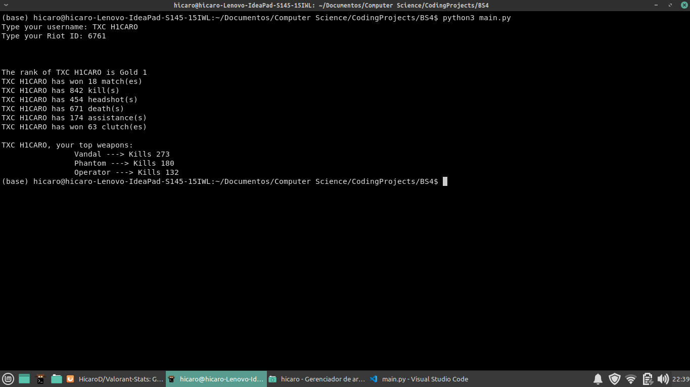

# Valorant Stats by H1CARO


## Goal
Learn more about Web Scraping with BeautifulSoup and Requests libraries. I'm using both libraries to extract informations of a website called tracker.gg/valorant

That's just for educational purposes and nothing more! 

## Libraries 
* BeautifulSoup - Python library for pulling data out of HTML and XML files
* Requests -  a simple, yet elegant HTTP library that allows you to send HTTP/1.1 requests extremely easily. 


## Read this first
To acess your informations through this program, your Riot Account has to be public. How do you know this?

### 1. Go to https://tracker.gg/valorant
On https://tracker.gg/valorant, Type your nickname and Riot ID.


If that shows up, your account is private. Now, select that checkbox "I acknowledge signing in makes my profile public to all users" and sign in with your Riot account. After that, everyone can acess your stats about the game. 

## Instalation of libraries

#### 1. Installing pip

Pip is the package installer for Python. On Linux, you can install through the terminal.

```
sudo apt install python3-pip

```

#### 2. Cloning my repository

```
git clone https://github.com/HicaroD/Valorant-Stats.git

```

#### 3. Installing the packages

First, go to the Valorant-Stats folder using ``` cd Valorant-Stats ``` and after that you can install the packages using ``` pip3 install -r requirements.txt```

#### 4. Execute the program

Make sure that you're in the folder of the project, after that execute the script in the command line using ```python3 main.py```


## Example


